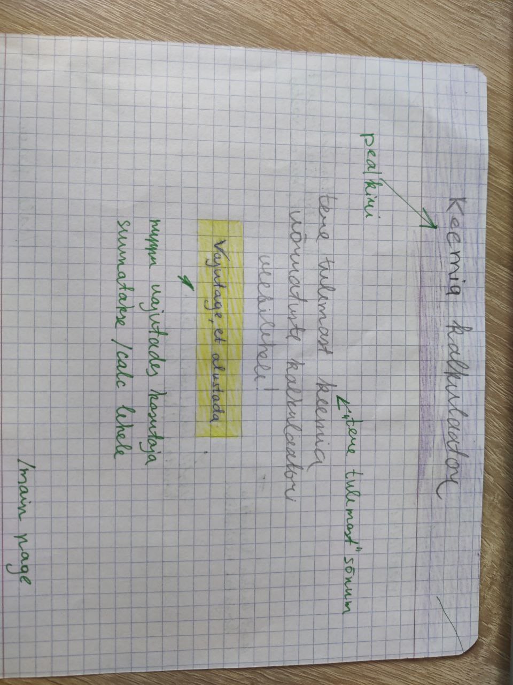
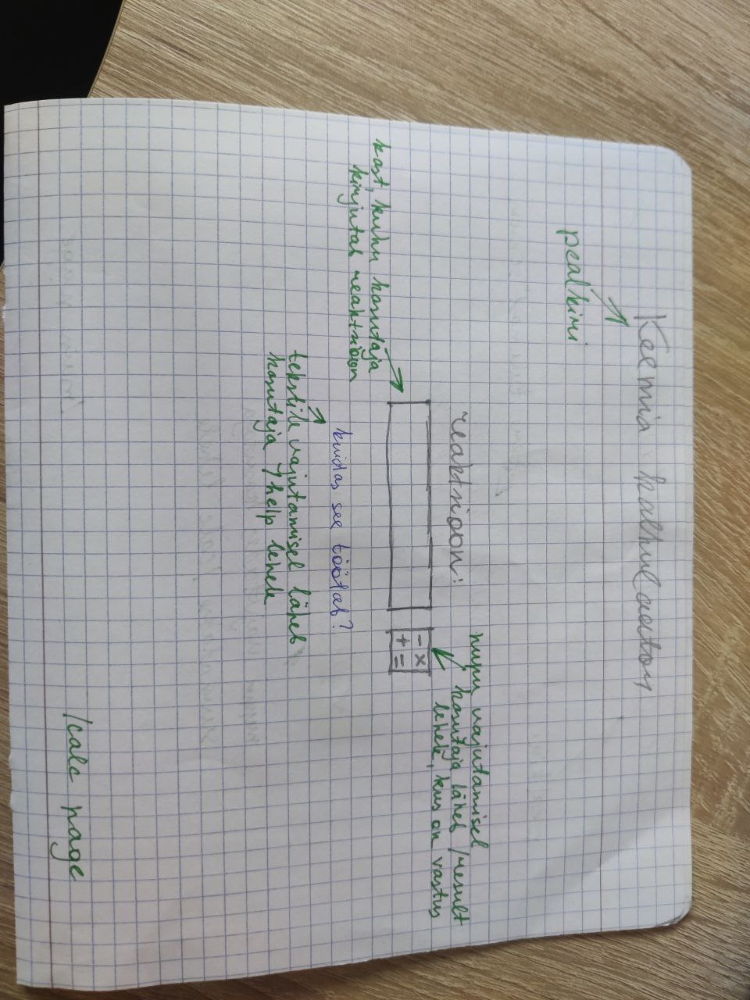
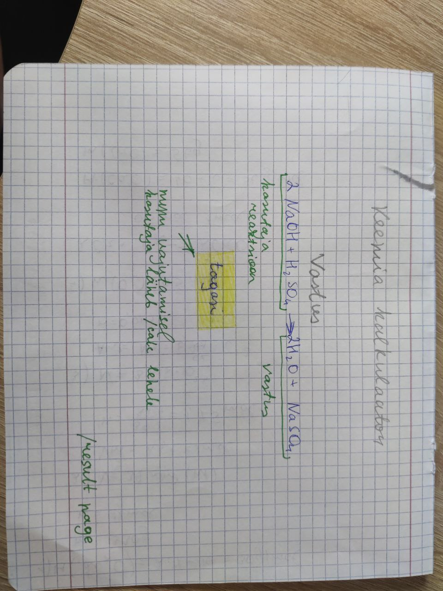
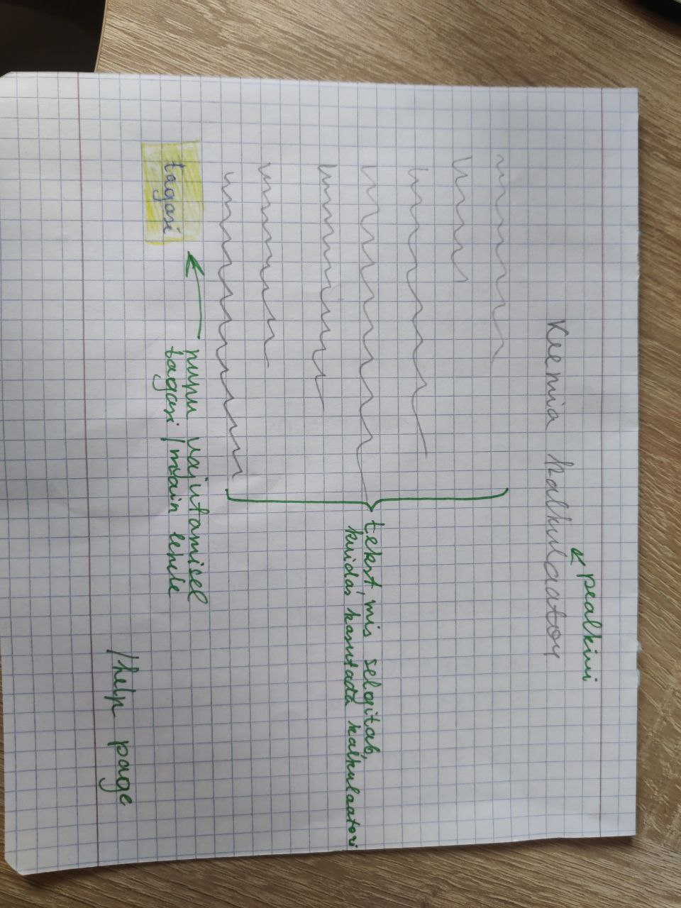

# Keemia kalkulaator

## Projekti kirjeldus
Kalkulaator, mille abil on võimalik võrrelda erinevaid keemilisi reaktsioone

Rakenduse tüüp: veebirakendused (Flask)
Reaktsioonide arvutamiseks ja andmebaasiga töötamiseks kasutatakse Python'i (kui see on olemas)

## Rühma liikmed
Jevgeni Golosov. Rollid: kasutajaliidese looja, frontend ja backend arendaja

## Trello
Link - https://trello.com/invite/b/R7Axf65m/ATTI6b9b39dae63bc9aeb3e50cebf81464ceBCDBF209/dev

## Veebirakenduse veebilehed

Veebirakendusel on 4 lehte:
* **/main** - avaleht. Kasutaja tervitamine ja nupp "Vajutage, et alustada"
* **/calc** - kalkulaatori leht. Siin kasutaja saab kirjutada reaktsiooni. Nupp "Arvuta"
* **/result** - vastusega leht
* **/help** -leht, kust kasutaja saab teavet sellest, kuidas kasutada veebilehte

## Paberprototüüp
*rohelise värviga tekst paberi peal - kommentaarid*

### Main page /main

### Calc page /calc

### Result page /result

### Help page /help
