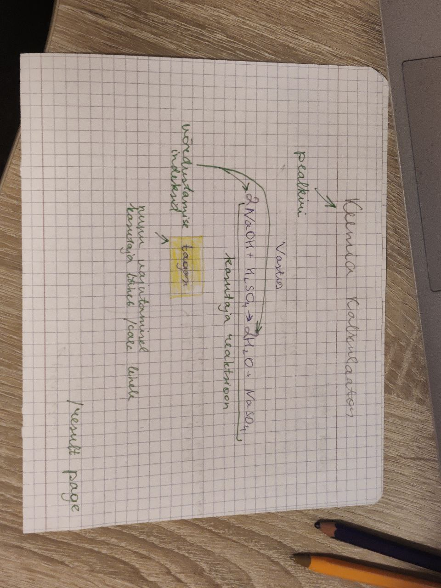

# Keemia kalkulaator

## Projekti kirjeldus
Kalkulaator, mille abil on võimalik võrrelda erinevaid keemilisi reaktsioone

Rakenduse tüüp: veebirakendused (Flask)
Reaktsioonide arvutamiseks ja andmebaasiga töötamiseks kasutatakse Python'i (kui see on olemas)

## Rühma liikmed
Jevgeni Golosov. Rollid: kasutajaliidese looja, frontend ja backend arendaja

## Trello
Link - https://trello.com/invite/b/R7Axf65m/ATTI6b9b39dae63bc9aeb3e50cebf81464ceBCDBF209/dev

## Vajalikud moodulid ja versioonid
* python 3.9.6
* flask 2.3.3

*suure tõenäosusega rakendus töötab ka varema versioonide moodulitega ja pythoniga*

## Veebirakenduse veebilehed

Veebirakendusel on 4 lehte:
* **/main** - avaleht. Kasutaja tervitamine ja nupp "Vajutage, et alustada"
* **/calc** - kalkulaatori leht. Siin kasutaja saab kirjutada reaktsiooni. Nupp "Arvuta"
* **/result** - vastusega leht
* **/help** -leht, kust kasutaja saab teavet sellest, kuidas kasutada veebilehte

## Paberprototüüp
*rohelise värviga tekst paberi peal - kommentaarid*

### Main page /main


### Calc page /calc


### Result page /result


### Help page /help


## Programmi tööle saamine
Programmi käivitamiseks vaja, et arvutil oleks paigaldadud kõik vajalikud moodulid.

1. Laadige repositooriumi alla
```
git clone https://github.com/JevGolo/proge4_project.git
```

2. Minge kausta "proge4_project" ja siis kausta "src"
```
cd proge4_project
cd src
```

3. Käivitage rakendus järgmise käsuga
```
python app.py
```

4. Käsureale ilmub teade, mis sisaldab rida "Running on \<aadress\>"

```
...
 * Running on http://127.0.0.1:5000
...
 ```

 5. Avage brauser ja sisestage see aadress otsingule. Edu korral kuvatakse ekraanil pealkiri "Hello world".